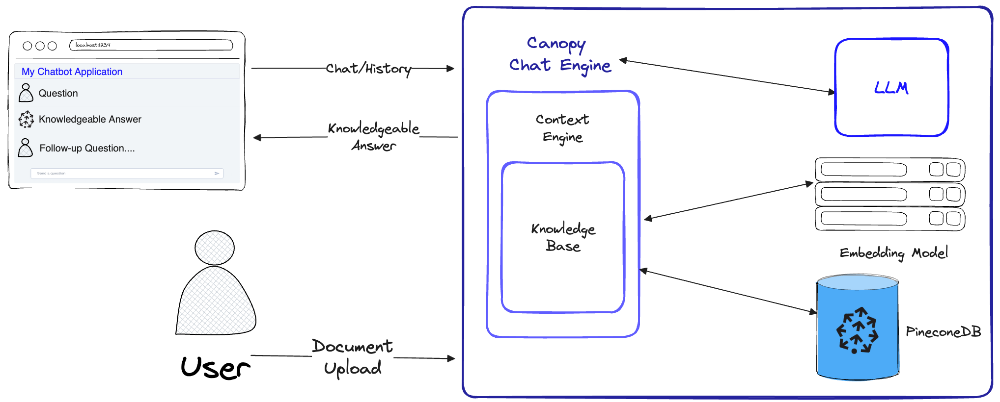

# Canopy

<p align="center">
<a href="https://pypi.org/project/canopy-sdk" target="_blank">
    
</a>
<a href="https://pypi.org/project/canopy-sdk" target="_blank">
    
</a>
</p>


**Canopy** is an open-source Retrieval Augmented Generation (RAG) framework and context engine built on top of the Pinecone vector database. Canopy enables you to quickly and easily experiment with and build applications using RAG. Start chatting with your documents or text data with a few simple commands.   

Canopy takes on the heavy lifting for building RAG applications: from chunking and embedding your text data to chat history management, query optimization, context retrieval (including prompt engineering), and augmented generation. 

Canopy provides a configurable built-in server so you can effortlessly deploy a RAG-powered chat application to your existing chat UI or interface. Or you can build your own, custom RAG application using the Canopy library. 

Canopy lets you evaluate your RAG workflow with a CLI based chat tool. With a simple command in the Canopy CLI you can interactively chat with your text data and compare RAG vs. non-RAG workflows side-by-side. 

Check out our [blog post](https://pinecone.io/blog/canopy-rag-framework) to learn more, or see a quick [tutorial here](https://www.youtube.com/watch?v=dVGPglKh80Y). 

## RAG with Canopy



Canopy implements the full RAG workflow to prevent hallucinations and augment your LLM with your own text data.

Canopy has two flows: knowledge base creation and chat. In the knowledge base creation flow, users upload their documents and transform them into meaningful representations stored in Pinecone's Vector Database. In the chat flow, incoming queries and chat history are optimized to retrieve the most relevant documents, the knowledge base is queried, and a meaningful context is generated for the LLM to answer.

## What's inside the box?

1. **Canopy Core Library** - The library has 3 main classes that are responsible for different parts of the RAG workflow:
    * **ChatEngine** - Exposes a chat interface to interact with your data. Given the history of chat messages, the `ChatEngine` formulates relevant queries to the `ContextEngine`, then uses the LLM to generate a knowledgeable response.
    * **ContextEngine**  - Performs the “retrieval” part of RAG. The `ContextEngine` utilizes the underlying `KnowledgeBase` to retrieve the most relevant documents, then formulates a coherent textual context to be used as a prompt for the LLM. 
    * **KnowledgeBase** - Manages your data for the RAG workflow. It automatically chunks and transforms your text data into text embeddings, storing them in a Pinecone vector database. Given a text query - the `KnowledgeBase` will retrieve the most relevant document chunks from the database. 


> More information about the Core Library usage can be found in the [Library Documentation](docs/library.md)

2. **Canopy Server** - This is a webservice that wraps the **Canopy Core** library and exposes it as a REST API. The server is built on top of FastAPI, Uvicorn and Gunicorn and can be easily deployed in production. 
The server also comes with a built-in Swagger UI for easy testing and documentation. After you [start the server](#3-start-the-canopy-server), you can access the Swagger UI at `http://host:port/docs` (default: `http://localhost:8000/docs`)

 3. **Canopy CLI** - A built-in development tool that allows users to swiftly set up their own Canopy server and test its configuration.  
With just three CLI commands, you can create a new Canopy server, upload your documents to it, and then interact with the Chatbot using a built-in chat application directly from the terminal. The built-in chatbot also enables comparison of RAG-infused responses against a native LLM chatbot.

## Setup

0. set up a virtual environment (optional)
```bash
python3 -m venv canopy-env
source canopy-env/bin/activate
```
> More information about virtual environments can be found [here](https://docs.python.org/3/tutorial/venv.html)

1. install the package
```bash
pip install canopy-sdk
```

2. Set up the environment variables

```bash
export PINECONE_API_KEY="<PINECONE_API_KEY>"
export PINECONE_ENVIRONMENT="<PINECONE_ENVIRONMENT>"
export OPENAI_API_KEY="<OPENAI_API_KEY>"
export INDEX_NAME="<INDEX_NAME>"
```

<details>
<summary><b><u>CLICK HERE</u></b> for more information about the environment variables 

<br /> 
</summary>

| Name                  | Description                                                                                                                 | How to get it?                                                                                                                                                               |
|-----------------------|-----------------------------------------------------------------------------------------------------------------------------|------------------------------------------------------------------------------------------------------------------------------------------------------------------------------|
| `PINECONE_API_KEY`    | The API key for Pinecone. Used to authenticate to Pinecone services to create indexes and to insert, delete and search data | Register or log into your Pinecone account in the [console](https://app.pinecone.io/). You can access your API key from the "API Keys" section in the sidebar of your dashboard |
| `PINECONE_ENVIRONMENT`| Determines the Pinecone service cloud environment of your index e.g `west1-gcp`, `us-east-1-aws`, etc                       | You can find the Pinecone environment next to the API key in [console](https://app.pinecone.io/)                                                                             |
| `OPENAI_API_KEY`      | API key for OpenAI. Used to authenticate to OpenAI's services for embedding and chat API                                    | You can find your OpenAI API key [here](https://platform.openai.com/account/api-keys). You might need to login or register to OpenAI services                                |
| `ANYSCALE_API_KEY`    | API key for Anyscale. Used to authenticate to Anyscale Endpoints for open source LLMs                                    | You can register Anyscale Endpoints and find your API key [here](https://app.endpoints.anyscale.com/)
| `CO_API_KEY`   | API key for Cohere. Used to authenticate to Cohere services for embedding                                           | You can find more information on registering to Cohere [here](https://cohere.com/pricing)
| `INDEX_NAME`          | Name of the Pinecone index Canopy will underlying work with                                                                  | You can choose any name as long as it follows Pinecone's [restrictions](https://support.pinecone.io/hc/en-us/articles/11729246212637-Are-there-restrictions-on-index-names-#:~:text=There%20are%20two%20main%20restrictions,and%20emojis%20are%20not%20supported.)                                                                                       |
| `CANOPY_CONFIG_FILE` | The path of a configuration yaml file to be used by the Canopy server. | Optional - if not provided, default configuration would be used |
</details>


3. Check that installation is successful and environment is set, run:
```bash
canopy
```

Output should be similar to this:

```bash
Canopy: Ready

Usage: canopy [OPTIONS] COMMAND [ARGS]...
# rest of the help message
```

## Quickstart

In this quickstart, we will show you how to use the **Canopy** to build a simple question answering system using RAG (retrieval augmented generation).

### 1. Create a new **Canopy** Index

As a one-time setup, Canopy needs to create a new Pinecone index that is configured to work with Canopy, just run:

```bash
canopy new
```

And follow the CLI instructions. The index that will be created will have a prefix `canopy--<INDEX_NAME>`.   
You only have to do this process once for every Canopy index you want to create.

> To learn more about Pinecone indexes and how to manage them, please refer to the following guide: [Understanding indexes](https://docs.pinecone.io/docs/indexes)

### 2. Uploading data

You can load data into your Canopy index using the command:

```bash
canopy upsert /path/to/data_directory
# or
canopy upsert /path/to/data_directory/file.parquet
# or
canopy upsert /path/to/data_directory/file.jsonl
# or
canopy upsert /path/to/directory_of_txt_files/
# ...
```

Canopy supports files in `jsonl`, `parquet` and `csv` formats. Additionally, you can load plaintext data files in `.txt` format. In this case, each file will be treated as a single document. The document id will be the filename, and the source will be the full path of the file. 

> **Note**: Document fields are used in the RAG flow and should comply with the following schema:

```bash
+----------+--------------+--------------+---------------+
| id(str)  | text(str)    | source       | metadata      |
|          |              | Optional[str]| Optional[dict]|
|----------+--------------+--------------+---------------|
| "id1"    | "some text"  | "some source"| {"key": "val"}|
+----------+--------------+--------------+---------------+

# id       - unique identifier for the document
#
# text     - the text of the document, in utf-8 encoding.
#
# source   - the source of the document, can be any string, or null.
#            ** this will be used as a reference in the generated context. **
#
# metadata - optional metadata for the document, for filtering or additional context.
#            Dict[str, Union[str, int, float, List[str]]]
```

[This notebook](https://colab.research.google.com/github/pinecone-io/examples/blob/master/learn/generation/canopy/00-canopy-data-prep.ipynb) shows how you create a dataset in this format, Follow the instructions in the CLI when you upload your data.

### 3. Start the Canopy server

The Canopy server exposes Canopy's functionality via a REST API. Namely, it allows you to upload documents, retrieve relevant docs for a given query, and chat with your data. The server exposes a `/chat.completion` endpoint that can be easily integrated with any chat application.
To start the server, run:

```bash
canopy start
```
Now, you should be prompted with the following standard Uvicorn message:
```
...

INFO:     Uvicorn running on http://0.0.0.0:8000 (Press CTRL+C to quit)
```
**That's it!** you can now start using the **Canopy** server with any chat application that supports a `/chat.completion` endpoint.

> The canopy start command will keep the terminal occupied (recommended use). 
> If you want to run the server in the background, you can use the following command - **```nohup canopy start &```**


### Stopping the server 
To stop the server, simply press `CTRL+C` in the terminal where you started it.

If you have started the server in the background, you can stop it by running:

```bash
canopy stop
```

## Evaluation chat tool

Canopy's CLI comes with a built-in chat app that allows you to interactively chat with your text data and compare RAG vs. non-RAG workflows side-by-side to evaluate the results

In a new terminal window, set the [required environment variables](#setup) then run:

```bash 
canopy chat
```

This will open a chat interface in your terminal. You can ask questions and the RAG-infused chatbot will try to answer them using the data you uploaded.

To compare the chat response with and without RAG use the `--no-rag` flag

> **Note**: This method is only supported with OpenAI at the moment.

```bash
canopy chat --no-rag
```

This will open a similar chat interface window, but will show both the RAG and non-RAG responses side-by-side.

## Considerations

* Canopy currently only supports OpenAI as the backend for both the embedding model and the LLM. Rate limits and pricing set by OpenAI will apply.  
* More integrations will be supported in the near future.

## Advanced usage

### Migrating an existing OpenAI application to **Canopy**

If you already have an application that uses the OpenAI API, you can migrate it to **Canopy** by simply changing the API endpoint to `http://host:port/v1`, for example with the default configuration:

```python
import openai

openai.api_base = "http://localhost:8000/v1"

# now you can use the OpenAI API as usual
```

or without global state change:

```python
import openai

openai_response = openai.Completion.create(..., api_base="http://localhost:8000/v1")
```

### Running Canopy server in production

Canopy is using FastAPI as the web framework and Uvicorn as the ASGI server. It is recommended to use Gunicorn as the production server, mainly because it supports multiple worker processes and can handle multiple requests in parallel, more details can be found [here](https://www.uvicorn.org/deployment/#using-a-process-manager).

To run the canopy server for production, please run:

```bash
gunicorn canopy_cli.app:app --worker-class uvicorn.workers.UvicornWorker --bind 0.0.0.0:8000 --workers <number of desired worker processes>
```

The server interacts with services like Pinecone and OpenAI using your own authentication credentials. When deploying the server on a public web hosting provider, it is recommended to enable an authentication mechanism, so that your server would only take requests from authenticated users.
