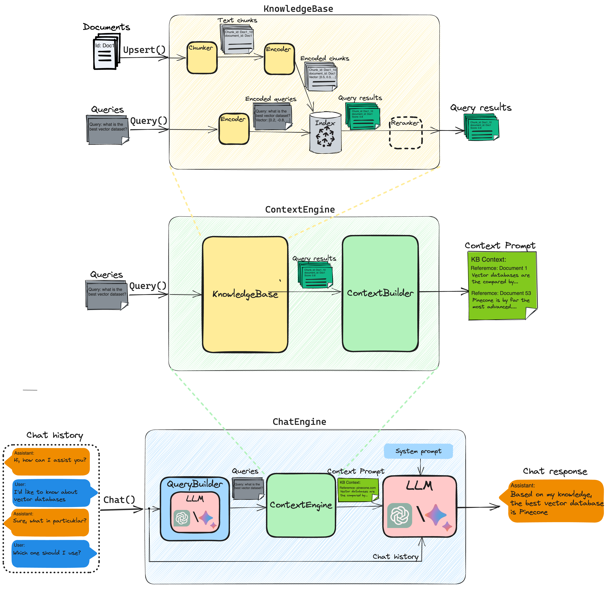

# Resin Library

For most common use cases, users can simply deploy the fully-configurable [Resin service](../README.md), which provides a REST API backend for your own RAG-infused Chatbot.  

For advanced users, this page describes how to use `resin` core library directly to implement their own custom applications. 

The idea behind Resin library is to provide a framework to build AI applications on top of Pinecone as a long memory storage for you own data. Resin library designed with the following principles in mind:

- **Easy to use**: Resin is designed to be easy to use. It is well packaged and can be installed with a single command.
- **Modularity**: Resin is built as a collection of modules that can be used together or separately. For example, you can use the `chat_engine` module to build a chatbot on top of your data, or you can use the `knowledge_base` module to directly store and search your data.
- **Extensibility**: Resin is designed to be extensible. You can easily add your own components and extend the functionality.
- **Production ready**: Resin designed to be production ready, tested, well documented, maintained and supported.
- **Open source**: Resin is open source and free to use. It built in partnership with the community and for the community.


## High level architecture



## Setup

To setup resin, please follow the instructions [here](../README.md#setup).

## Quickstart

### Step 1: Initialize global Tokenizer

The `Tokenizer` object is used for converting text into tokens, which is the basic data represntation that is used for processing.

Since manny different classes rely on a tokenizer,  Resin uses a singleton `Tokenizer` object which needs to be initialized once. 

Before instantiating any other resin core objects, please initialize the `Tokenizer` singleton:

```python
from resin.tokenizer import Tokenizer
Tokenizer.initialize()
```

Then, each time you want to use the tokenizer, you can simply instantiate a local object:

```python
from resin.tokenizer import Tokenizer

# no need to pass any parameters, the global tokenizer will be used
tokenizer = Tokenizer()

tokenizer.tokenize("Hello world!")
# output: ['Hello', 'world', '!']
```

Since the `tokenizer` object created here would be the same instance that you have initialized at the beginning of this subsection.

By default, the global tokenizer is initialized with `OpenAITokenizer` that is based on OpenAI's tiktoken library and aligned with GPT 3 and 4 models tokenization.

<details>
<summary>👉 Click here to understand how you can configure and customize the tokenizer</summary>
The `Tokenizer` singleton is holding an inner `Tokenizer` object that implements `BaseTokenizer`.

You can create your own customized tokenizer by implementing a new class that derives from `BaseTokenizer`, then passing this class to the `Tokenizer` singleton during initialization. Example:
```python
from resin.tokenizer import Tokenizer, BaseTokenizer

class CustomTokenizer(BaseTokenizer):
    # Implement BaseToknizer's abstract methods, like `def tokenize()` etc.
    # ....
    
Tokenizer.initialize(tokenizer_class=CustomTokenizer)
```

When you initialize the `Tokenizer` singleton, you can pass init arguments to the underlying Tokenizer class. Any init argument that is expected by the underlying class's constructor, can be passed as `kwarg` directly to `Tokenizer.initalize()`. For example:

```python
from resin.tokenizer import Tokenizer
from resin.tokenizer.openai import OpenAITokenizer
Tokenizer.initialize(tokenizer_class=OpenAITokenizer, model_name="gpt2")
```

Will initialize the global tokenizer with `OpenAITokenizer` and will pass the `model_name` parameter to the underlying tokenizer.
</details>


### Step 2: Create a knowledge base
Knowledge base is an object that is responsible for storing and query your data. It holds a connection to a single Pinecone index and provides a simple API to insert, delete and search textual documents.

To create a knowledge base, you can use the following command:

```python
from resin.knowledge_base import KnowledgeBase

kb = KnowledgeBase(index_name="my-index")
```

To create a new Pinecone index and connect it to the knowledge base, you can use the `create_resin_index` method:

```python
kb.create_resin_index()
```

Then, you will be able to mange the index in Pinecone [console](https://app.pinecone.io/).

If you already created a Pinecone index, you can connect it to the knowledge base with the `connect` method:

```python
kb.connect()
```

You can always verify the connection to the Pinecone index with the `verify_index_connection` method:

```python
kb.verify_index_connection()
```

To learn more about customizing the KnowledgeBase and its inner components, see [understanding knowledgebase workings section](#understanding-knowledgebase-workings).

### Step 3: Upsert and query data

To insert data into the knowledge base, you can create a list of documents and use the `upsert` method:

```python
from resin.models.data_models import Document
documents = [Document(id="1", text="U2 are an Irish rock band from Dublin, formed in 1976.", source="https://url.com"),
             Document(id="2", text="Arctic Monkeys are an English rock band formed in Sheffield in 2002.", source="https://another-url.com", metadata={"my-key": "my-value"})]
kb.upsert(documents)
```

Now you can query the knowledge base with the `query` method to find the most similar documents to a given text:

```python
from resin.models.query_models import Query
results = kb.query([Query("Arctic Monkeys music genre"),
                    Query(text="U2 music genre",
                          top_k=10,
                          metadata_filter={"my-key": "my-value"})])

print(results[0].documents[0].text)
# output: Arctic Monkeys are an English rock band formed in Sheffield in 2002.
```

### Step 4: Create a context engine

Context engine is an object that responsible to retrieve the most relevant context for a given query and token budget.  
The context engine first uses the knowledge base to retrieve the most relevant documents. Then, it  formalizes the textual context that will be presented to the LLM. This textual context might be structured or unstructured, depending on the use case and configuration. 
The output of the context engine is designed to provide the LLM the most relevant context for a given query. 


To create a context engine using a knowledge base, you can use the following command:

```python
from resin.context_engine import ContextEngine
context_engine = ContextEngine(kb)
```

Then, you can use the `query` method to retrieve the most relevant context for a given query and token budget:

```python
result = context_engine.query([Query("Arctic Monkeys music genre")], token_budget=100)

print(result.content)
# output: Arctic Monkeys are an English rock band formed in Sheffield in 2002.

print(result.token_count)
# output: 17
```

By default, to handle the token budget constraint, the context engine will use the `StuffingContextBuilder` that will stuff as many documents as possible into the context without exceeding the token budget, by the order they have been retrieved from the knowledge base.


<details>
<summary>Go deeper</summary>
TBD
</details>


### Step 5: Create a chat engine

Chat engine is an object that implements end to end chat API with [RAG](https://www.pinecone.io/learn/retrieval-augmented-generation/).
Given chat history, the chat engine orchestrates its underlying context engine and LLM to run the following steps:

1. Generate search queries from the chat history
2. Retrieve the most relevant context for each query using the context engine
3. Prompt the LLM with the chat history and the retrieved context to generate the next response

To create a chat engine using a context, you can use the following command:

```python
from resin.chat_engine import ChatEngine
chat_engine = ChatEngine(context_engine)
```

Then, you can start chatting!

```python
chat_engine.chat("what is the genre of Arctic Monkeys band?")
# output: Arctic Monkeys is a rock band.
```


Resin designed to be production ready and handle any conversation length and context length. Therefore, the chat engine uses internal components to handle long conversations and long contexts.
By default, long chat history is truncated to the latest messages that fits the token budget. It orchestrates the context engine to retrieve context that fits the token budget and then use the LLM to generate the next response.


<details>
<summary>Go deeper</summary>
TBD
</details>


## Understanding KnowledgeBase workings
 
The knowledge base is an object that is responsible for storing and query your data. It holds a connection to a single Pinecone index and provides a simple API to insert, delete and search textual documents.

### Upsert workflow
The `upsert` method is used to insert of update textual documents of any size into the knowledge base. For each document, the following steps are performed:

1. The document is chunked into smaller pieces of text, each piece is called a `Chunk`.
2. Each chunk is encoded into a vector representation.
3. The vector representation is inserted into the Pinecone index along with the document text and metadata.

### Query workflow

The `query` method is used to retrieve the most similar documents to a given query. For each query, the following steps are performed:
1. The query is encoded into a vector representation.
2. The vector representation is used to search the Pinecone index for the most similar vectors.
3. The retrieved vectors are decoded into `DocumentWithScore` objects and returned inside a `QueryResult` object.

In the future, we intend to introduce a re-ranking phase to enhance the initial query outcomes.

### KnowledgeBase components

The knowledge base is composed of the following components:

- **Index**: A Pinecone index that holds the vector representations of the documents.
- **Chunker**: A `Chunker` object that is used to chunk the documents into smaller pieces of text.
- **Encoder**: An `RecordEncoder` object that is used to encode the chunks and queries into vector representations.

By default the knowledge base is initialized with `OpenAIRecordEncoder` which uses OpenAI embedding API to encode the text into vector representations, and `MarkdownChunker` which is based on a cloned version of Langchain's `MarkdownTextSplitter` [chunker](https://github.com/langchain-ai/langchain/blob/95a1b598fefbdb4c28db53e493d5f3242129a5f2/libs/langchain/langchain/text_splitter.py#L1374C7-L1374C27).


You can customize each component by passing any instance of `Chunker` or `RecordEncoder` to the `KnowledgeBase` constructor.
To read more about these classes please refer to the docstrings of `Chunker` and `RecordEncoder`.

